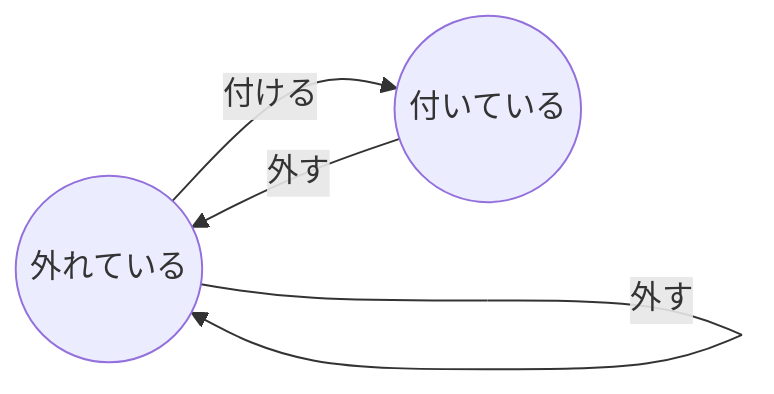

# バッジの設計

"バッジ"の設計を行う

## バッジの仕様

ユーザーが何かしらを達成した証として、バッジを与える
バッジは次の仕様を持つ

1. バッジは着脱できる
2. バッジは"名前"を持つ

## 有限オートマトン

有限オートマトンを使って、バッジが何であるかを整理する

## 状態遷移図

上記の有限状態機械を状態遷移表に書き下す

| 現在の状態 | イベント | 次の状態   |
| ---------- | -------- | ---------- |
| 外れている | 付ける   | 付いている |
| 外れている | 外す     | 外れている |
| 付いている | 外す     | 外れている |
