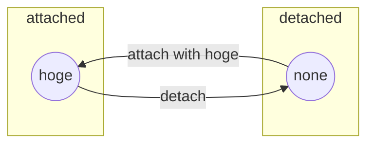

# タグの設計

"タグ"の設計を行う

## タグの仕様

<!-- 画像を貼る -->

1. タグは着脱できる
2. タグは"名前"を持つ

## 有限状態機械

仕様1の`タグは着脱できる`ことから、タグは`attached`と`detached`を持つ
仕様2はタグが`attached`の時は、名前があることを意味する
これらを有限状態機械に落とし込むと次の通り

ここで、円の中身はタグの名前を指す
ただし`none`は名前が存在しないことを表す

## 状態遷移図

上記の有限状態機械を状態遷移図に書き下す

| 遷移前                   | 状態変化           | 遷移後                   |
| ------------------------ | ------------------ | ------------------------ |
| Detached Tag             | attach with "hoge" | Attached Tag with "hoge" |
| Attached Tag with "hoge" | detach             | Detached Tag             |
