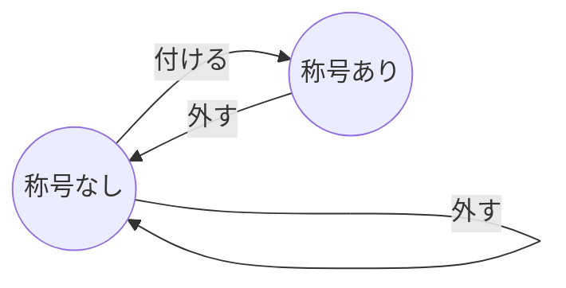

# 称号の設計

"称号"の設計を行う

## 称号の仕様

ユーザーが何かしらを達成した証として、称号を与える
称号は次の仕様を持つ

1. 称号は着脱できる
2. 称号は"テキスト"を持つ

## 有限オートマトン

有限オートマトンを使って、称号が何であるかを整理する

## 状態遷移図

上記の有限状態機械を状態遷移表に書き下す

| 現在の状態 | イベント | 次の状態 |
| ---------- | -------- | -------- |
| 称号なし   | 付ける   | 称号あり |
| 称号なし   | 外す     | 称号なし |
| 称号あり   | 外す     | 称号なし |
